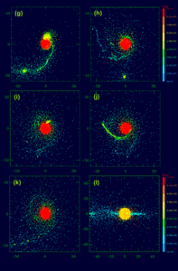
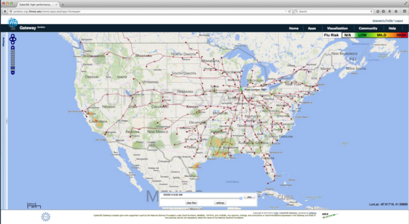

# Viz Motivations, SciViz, and D3

---

# Final Project

Your final project, to be completed in (assigned) groups, is to build a semi-realtime "observatory" of data.  You can find a few different possibilities for the data, but I want to encourage you to think of data related to things like:

- Earthquakes
- Space weather, rocks and satellites
- Weather
- Political events and news
- Nothing directly COVID related

---

# Final Project: Phases

Your final project will have three phases, each of which will have a component for you to turn in.  The second and third components will be turned in as a group, but the first component will be individually graded.

**Before beginning, clear your dataset with me, Esther and Tali.**

Some places to look for dataset ideas:

- [Awesome Public Datasets](https://github.com/awesomedata/awesome-public-datasets)
- [Public APIs](https://github.com/public-apis/public-apis)
- [Awesome JSON](https://github.com/jdorfman/awesome-json-datasets)


---

# Final Project: Part One

The first part of your project will be to *explore* the data; this is worth **30 points out of 100**.  You are to turn in a notebook -- whether in Observable, Python, Iodide, or a *combination* of them, that includes every single cell and step you took in exploring the data.  This is an example of the "visualization for self" process.  This means you might take shortcuts, you might make mistakes, and you might make really, really awful visualizations.

Showing that you explored the data individually (even if you did it while talking to a collaborator or classmate) is enough to satisfy this portion of the project.

Download the data.  Dig in to it.  Look at it.  Find interesting things. Experiment.  Make plots, make summary statistics, and make it familiar to yourself.

---

# Final Project: Part Two

The second component of your project will be to design your "observatory." Note that this is *pseudo* realtime.  It does not need to *automatically* update its data; a refresh button, or requiring a page reload, is sufficient.  This is worth **40 points out of 100**.

This could consist of drawings, prototypes of web pages or notebooks, and the code necessary to build the different components.  This component is *scaffolding*, not the final product.  It should be thought of as the "viz for peers" stage of the process.  You can submit drawings (including photos of drawings), jamboards, notebooks (which you *are* allowed to clean up), and stages of prototypes.

You should walk me through the process of how you built your observatory, and it does not need to be a linear, successes-only process.


---

# Final Project: Part Three

The final component of your project will be an in-class presentation of your work, and the deployment of that work online.  This will be worth **30 points out of 100**.

Your "observatory" should be located somewhere online, either as a notebook I can download and run (or that runs on [binder](https://mybinder.org/)) or view on observable, starboard, or Github Pages.

You will also have five minutes, as a *group*, to present your work in class. This presentation needs to include the final product, as well as a summary of any stumbling blocks you might have had, and a little bit of the process.

These presentations will be on the 4th of December.  The project will be due by the end of finals week, but you are **strongly encouraged** to submit earlier.

---

## Classes of Visualization

1. Viz for Self
1. Viz for Colleagues
1. Viz for Others

---

## Viz for Self

We can think of this as telling a story to yourself.

You can take shortcuts -- you can skip labels, colors, and so on, *sort of*.  You just have to make sure you're not lying to yourself.


---


## Viz for Self

How do we explore data?

- What characteristic of data influence how you visualize it?
- What information do you have that would be visually interesting?
- What information do you *not* have that you need in order to understand the importance of the data?

<div class="r-stack">
<p class="fragment fade-in-then-out">Example: A banking database where each record is a bank transaction and the fields include date, deposit or withdrawal amount, customer id, and the interest rate of the account.</p>
<p class="fragment fade-in-then-out">Example: A spreadsheet of experimental crop growth measurements where each record is a measurement, and the fields include date, plant species, plant id number, number of leaves, plant height, number of internodes, and average leaf length.</p>
<p class="fragment fade-in-then-out">Example: A computational simulation of a galaxy where each record is a timestep in the evolution of the 3D grid, and the fields include time, X position, Y position, Z position, gas density, gas temperature, gas metallicity, and number of stars.</p>
</div>


---


## Viz for Self

What do you want to get out of visualization for yourself?

- Do you want to find meaning?
- Do you want to understand how to guide further visualizations?
- Is the story you want to tell already known to you?
- What __shortcuts__ can you take?


---

## Viz for Experts

To design a visualization for experts, you need to analyze how they process information.

- What do they know?
- What conventions will they assume?
- Are they able to fill in the blanks of information?


---


## Viz for Experts

<iframe width="1024" height="576"
src="https://www.youtube.com/embed/FG1NNH7Kmok?rel=0" frameborder="0"
allow="encrypted-media" allowfullscreen></iframe>

notes:
This is from Chris Havlin, and it's vorticity of a tornado


---


## Viz for Experts



notes:
Here's a series of visualizations made by or for domain experts that I just had lying around on my laptop.

What are some things you notice they have in common?


---


## Viz for Experts



notes:
Here's a series of visualizations made by or for domain experts that I just had lying around on my laptop.

What are some things you notice they have in common?


---


## Viz for Experts


notes:
Here's a series of visualizations made by or for domain experts that I just had lying around on my laptop.

What are some things you notice they have in common?


---


## Viz for Experts

Experts often want to interrogate the data themselves.

How can they do that?

- Linked Dashboards
- Side-by-side comparison plots
- Text annotation with specific values listed
- Color bar annotation

notes:
ask students - other ideas? what about interactivity? (Interactivity needs to be decent)


---


## Viz for Experts

Experts are looking to isolate variables to make scientific conclusions.

How can we make visualizations more analytical?

- Reduce the dimensionality of the image (slices)
- Viewpoint from "outside the box"
- Extremely high contrast color choices (or highlight different features)

notes:
ask students - other ideas? What about animated data?


---

## Viz for the Public

This is what you're most accustomed to, because usually YOU are the public.

Communicating information to the public is an entire field, and I encourage you to take IS457 - Data Storytelling for a more comprehensive discussion.

---

## Scientific Visualization

What characterizes "scientific" visualization?

- Spatial organization - distance metrics
- Dimensionality reduction or mapping
- Multiple overlapping quantities with implicit or explicit extent

---

## Scientific Visualization - Data Representations

<div class="multiCol">
<div class="col">
<div class="fig-container" data-style="height: 600px;" data-file="figures/blank_axes.html" data-markdown=true>
</div>
</div>
<div class="col" data-markdown=true>

Commonly, data will be represented in "scientific visualization" through one of a few mechanisms:

- Discrete points
- Volume-filling information
- Meshed values

</div>
</div>


---

## Discrete Points: Data

<div class="multiCol">
<div class="col">
<div class="fig-container" data-style="height: 600px;" data-file="figures/scatter.html" data-markdown=true>
</div>
</div>
<div class="col" data-markdown=true>

- Associated field values
- May have extent
- Values can be either
  - Locally defined
  - Integrated over neighbors

</div>
</div> 

---

## Discrete Points: Density Estimates

- Searching
  - Quadtree
  - kD-tree
- Integration
  - Kernels
  - Nearest-neighbor

---

## Discrete Points: Techniques

<div class="multiCol">
<div class="col">
<div class="fig-container" data-style="height: 600px;" data-file="figures/discrete_tech.html" data-markdown=true>
</div>
</div>
<div class="col" data-markdown=true>

- Associated field values
- May have extent
- Values can be either
  - Locally defined
  - Integrated over neighbors

</div>
</div> 


---

## Volume data: strategies

To analyze volume data, typically we conduct one or more of these operations:

- Select data based on spatial or non-spatial criteria
- Reduce the dimensionality of that data either along spatial or other axes
- Aggregate data

This can include operations such as volume rendering, axial projection, histogramming/binning and resampling.

---

## Big-ish Data

How do we deal with data that is too large to fit into memory?

- Can we cycle our operations?
- Can we use tools to cycle operations?

---

## Operations

Some operations we can manually cycle through, storing only reductions in memory rather than the full dataset.

Clear candidates:

- Mean
- Extrema
- Histograms and "binning"

Is this the same as incremental updates to a dataset?

(What about the median?)


---

## A Little Bit of D3

We're going to learn a very small bit of [d3.js](https://d3js.org/).

We will utilize D3 on [starboard.gg](https://starboard.gg).  We do this by including it from a CDN, as we did for vega last time:

<code>
&lt;script src="https://d3js.org/d3.v7.min.js"&gt;&lt;/script&gt;
</code>


---

## Concepts in d3: outline

The basic concepts here we will convey, focusing on *static* visualizations:

- `.select()` and `.selectAll()`
- `.enter()`
- `.attr()` and `.style()`
- `d3.scaleLinear()`

---

## Concepts in d3: data and elements

When we manipulate items in d3, we connect the concept of a data item to an element in a document.

Typically, this will be an element in an SVG -- for instance, a `line`,
`circle`, `rect` or `text` element.

Our typical workflow:

1. Select all items of a specific criteria
1. Bind these items to a set of data
1. Update, append or remove items based on their corresponding item.

---

## Concepts in d3: accessors and setters

We will very frequently run into the case where we call something, and supply a *function* to it, rather than supplying a value.  For instance, *both* of these calls to `attr` are valid in a typical d3 workflow:

```javascript
.attr("cx", 1.0)

// or

.attr("cx", d => d.x)
```

In one, we are setting the value static; in the other, we base the value on the datapoint supplied.

---

## Concepts in d3: Let's make circles

For our first exploration, let's just make some circles.  I will demonstrate this in observable, but here is the key snippet of code:

```
var dataset = [ {'x': 100, 'y': 200, 'radius': 15},
                {'x': 150, 'y': 300, 'radius': 30} ];
svg.selectAll("circle").data(dataset).enter()
   .append("circle")
   .attr("cx", d => d.x)
   .attr("cy", d => d.y)
   .attr("r", d => d.radius)
   .style("fill", "black");
```

What does this do?

---

## Concepts in d3: Objects

We will mostly use the objects

- [`rect`](https://developer.mozilla.org/en-US/docs/Web/SVG/Element/rect) -- which has `x`, `y`, `width` and `height`
- [`circle`](https://developer.mozilla.org/en-US/docs/Web/SVG/Element/circle) -- which has `cx`, `cy`, and `r`
- [`line`](https://developer.mozilla.org/en-US/docs/Web/SVG/Element/line) -- which has `x1`, `x2`, `y1` and `y2`.

Each of these objects can be controlled in style, appearance, position, etc, according to standard SVG and CSS rules.

Let's experiment!

---

## Concepts in d3: Scaling

To map from a given range to a different range in a linear fashion, we can construct a linear scale:

```javascript
var xScale = d3.scaleLinear().range([0, 100]).domain([0.0, 1.0]);
```

This is now an object we can use to map the values 0 .. 1 to 0 .. 100.  This is useful for, among other things, computing the position of a given value:

```javascript
.attr("cx", d => xScale(d.x))
```

---

## Additional Basic Topics

`d3.axisBottom(xScale)` can be used to create ticks and axes; however, it requires manual translation using the `transform` attribute, using something like `.attr("transform", "translate(0, 30)")`.  This then brings up our concept of margins, width, height, and the like!  How can we manage these?

Let's try it out!


---

## Creating an SVG canvas

We can create one programmatically:

```javascript
const svg = d3.create("svg")
  .attr("id", "my_svg")
  .attr("width", 300)
  .attr("height", 300);
```

or, in starboard, we can create one through standard HTML:

```
<svg id="my_svg">
```

which we can then *select*:

```javascript
const svg = d3.select("#my_svg")
```

---

# Selecting and binding data

```javascript

var dataset = [
  {x1: 1.0, y1: 3.0, x2: 3.5, y2: 2.0, radius: 10},
  {x1: 2.5, y1: 2.0, x2: 0.75, y2: 3.5, radius: 5},
  {x1: 3.1, y1: 0.6, x2: 4.1, y2: 3.4, radius: 25}
];

svg.selectAll("circle")
   .data(dataset)
   .enter()
   .attr("cx", d => xScale(d.x1))
   .attr("cy", d => yScale(d.y1))
   .attr("r", d => d.radius)
   .style("fill", "black");
```


---

## Events

There are many events that we can "listen" for, and respond to.  For instance, the `click` event is a common event to manage.

The function receives the data (if any), the index of the node, and the nodelist.

```javascript
d3.selectAll("circle")
  .on("click", (d, i, n) => {
    d3.select(n[i]).attr("r", 100)
  });
```


---

## Transitions

We can also update items through transitions, which can accept both a `delay` and a `duration`, both specified in milliseconds.

```javascript
d3.selectAll("circle")
  .data(dataset)
  .transition()
  .duration(2000)
  .attr("x", d => d.x + 2)
```

Updating attributes utilizes "tween"-ing functions for interpolation.  Many are built in, but you can choose to build your own.


---

## D3 Notes: HTML

Anything that is in the DOM can be selected by, and modified by, D3.

```
`<p id="my_hi">hi there</p>`
```

How might we modify this paragraph?


---

## Transformations

SVG specifies a number of [possible transformations](https://developer.mozilla.org/en-US/docs/Web/SVG/Attribute/transform).  These include rotation, translations, skews and scales.  We can set these through the `.attr` call, but note that this requires a bit of string manipulation.

```javascript
svg.selectAll("circle").attr("transform",
    (d, i) => "skewY(" + i*5 + ")");
```

Note that we're concatenating an integer to a string here, which casts the int to a string.  This is a bit non-intuitive.

We can use this to reshape our objects in many different ways -- especially using the index of the data point!


---

## Scales

D3 provides a number of different [scaling types](https://github.com/d3/d3-scale).  We will be discussing, specifically, banded scales and color scales.

One thing to note is that d3 also provides handy functions for computing properties of [arrays](https://github.com/d3/d3-array).  For instance:

- `d3.min`, `d3.max`, `d3.minIndex` and `d3.maxIndex`, all of which accept both an iterable *and* an "accessor" function.
- `d3.extent`, which provides the format required by a scale.
- `d3.sum`, `d3.mean`, `d3.median`, `d3.quantil`, `d3.variance`

---

## Linear and Numeric Scaling

```javascript
var xScale = d3.scaleLinear().range([0, 100]).domain([0.0, 1.0]);
```

We can construct objects that map between a *domain* and a *range*.  Here, we are mapping the data values 0.0 .. 1.0 to the values 0 .. 100.  This has the effect of allowing us to take data values and scale them to, for instance, pixel values.

---

## Banded Scales

Banded scales provide discrete categorization of values, often used for categorical data.

```javascript
var band = d3.scaleBand(["low", "medium", "high"], [0.0, 100.0]);
```

This takes an array of input values for the domain.  Additional changes can be made to the bandwidth, padding, etc. The d3 wiki has a\
[diagram](https://raw.githubusercontent.com/d3/d3-scale/master/img/band.png) describing this.

---

## Color Scales

We can use `d3.scaleSequential` to generate colormaps for continuous values.  These accept an interpolator function.  d3 provides interpolator functions for many common colormaps.  For instance:

```javascript
var csc = d3.scaleSequential(d3.interpolateViridis).domain([1.0, 100.0])
```

We can also use log versions of these, and quantized versions.


---

## Brushing

Brushing in d3 requires some build-it-yourself effort, but building a brush object itself is straightforward.  You create a brush object with extents, and you call that on your object.  Here, `brushed` is a function to be called when the brush selection changes.

```

function brushed() {
  console.log(d3.event.selection);
}

var brush = d3.brush()
              .extent([[0.0, 0.0], [512, 512]])
              .on("brush", brushed);
svg.append("g").attr("class", "brush").call(brush);
```

What could we do with this?


---

## Paths

d3 can also generate `path` objects.  Typically these are generated using curve generators.

```javascript
var line = d3.line().curve(
            d3.curveCatmullRom.alpha(0.5));
var myPath = svg.append("path")
              .attr("d", line(myPoints))
              .attr("stroke", "black");

```

Interpolation of paths can be tricky, but it is possible.
